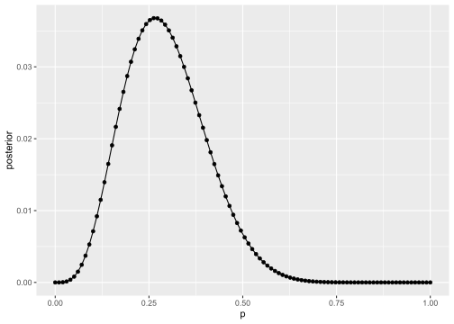
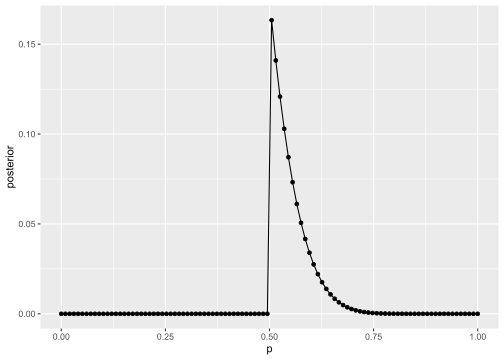
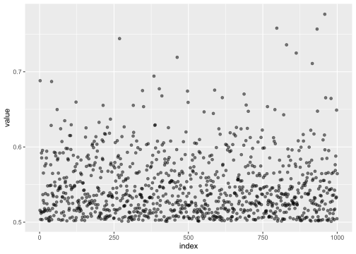
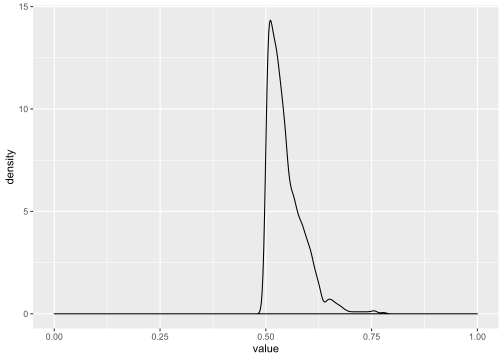
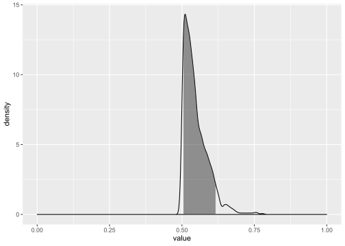
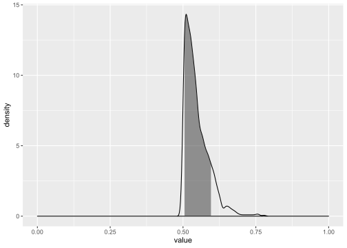

Week 1
================

``` r
knitr::opts_chunk$set(echo = TRUE, dev = "svg")

library(tidyverse)
library(rethinking)
```

# Question 1

Define our model:

$$
W \\sim \\text{Binomial}(n, p)\\\\
p \\sim \\text{Uniform} (0, 1)
$$

We observe 4 waters in 15 tosses. We can make a grid approximation of
the posterior:

``` r
grid_size <- 100
p_grid <- seq(0, 1, length.out = grid_size)
prior <- rep(1, grid_size)
lik <- dbinom(x = 4, size = 15, prob = p_grid)

unscaled_posterior <- lik * prior
posterior <- unscaled_posterior / sum(unscaled_posterior)
```

Plotted:

``` r
tibble(p = p_grid,
       posterior = posterior) %>%
  ggplot(aes(p, posterior)) +
  geom_point() +
  geom_line()
```

<!-- -->

# Question 2

With a ?better? prior:

``` r
dprior_2 <- function(p) {
  ifelse(p >= 0.5 &  p <= 1,
         1,
         0)
}

prior_2 <- dprior_2(p_grid)

unscaled_posterior2 <- lik * prior_2
posterior2 <- unscaled_posterior2 / sum(unscaled_posterior2)
```

Plotted:

``` r
tibble(p = p_grid,
       posterior = posterior2) %>%
  ggplot(aes(p, posterior)) +
  geom_point() +
  geom_line()
```

<!-- -->

# Question 3

Sample from the posterior we computed in **2**.

``` r
sample_n <- 1000

post_sample <- sample(p_grid,
                      prob = posterior2,
                      size = sample_n,
                      replace = TRUE)

samples <- tibble(
  index = 1:sample_n,
  value = post_sample
)
```

Plotted:

``` r
samples %>%
  ggplot(aes(index, value)) +
  geom_jitter(alpha = 1/2)
```

<!-- -->

There is some quantisation because our grid approximation only has 100
points - and half of them won’t produce any samples due to our prior.

The posterior PDF looks a lot like our grid approximation, though:

``` r
dens_plot <- samples %>%
  ggplot(aes(value)) +
  geom_density(outline.type = "full", adjust = 3/4) +
  scale_x_continuous(limits = c(0, 1))
dens_plot
```

<!-- -->

The 89th percentile interval:

``` r
int_89 <- PI(post_sample, prob = 0.89)
int_89
```

    ##        5%       94% 
    ## 0.5050505 0.6161616

Plotted:

``` r
post_density <- density(post_sample, adjust = 3/4, n = 1024)
post_dens_df <- tibble(x = post_density$x,
                       y = post_density$y)
 
dens_plot +
  geom_area(data = filter(post_dens_df,
                          x >= int_89[1],
                          x <= int_89[2]),
            mapping = aes(x, y),
            alpha = 1/2)
```

<!-- -->

… and the HDPI interval, which is really pretty similar. Could be due to
our quantisation?

``` r
int_hpd <- HPDI(post_sample, 0.89)
int_hpd
```

    ##     |0.89     0.89| 
    ## 0.5050505 0.5959596

Plotted:

``` r
dens_plot +
  geom_area(data = filter(post_dens_df,
                          x >= int_hpd[1],
                          x <= int_hpd[2]),
            mapping = aes(x, y),
            alpha = 1/2)
```

<!-- -->
